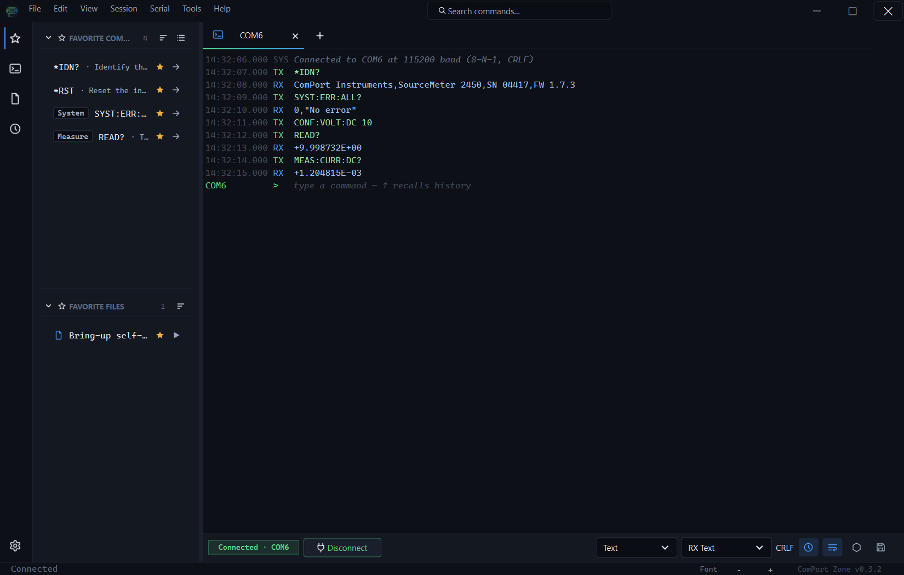
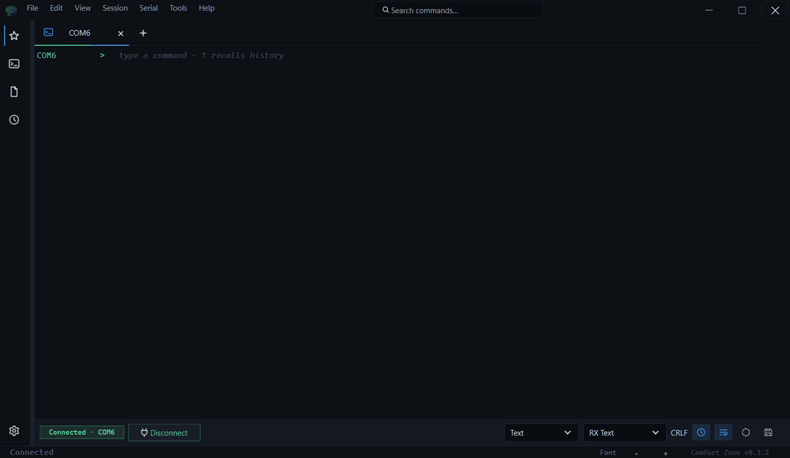
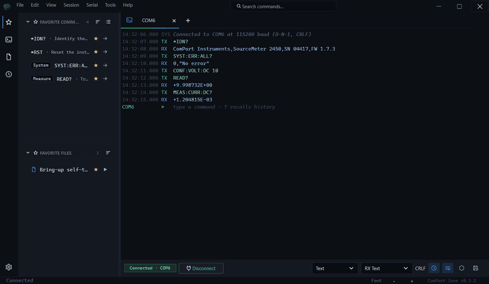
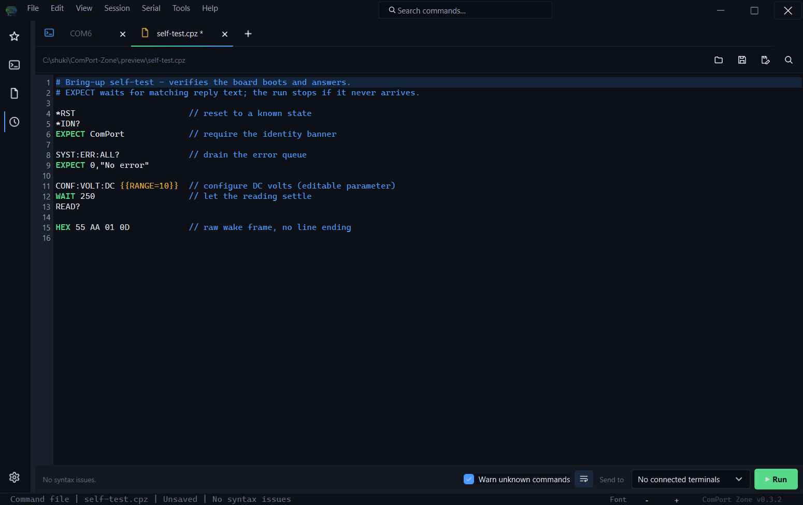
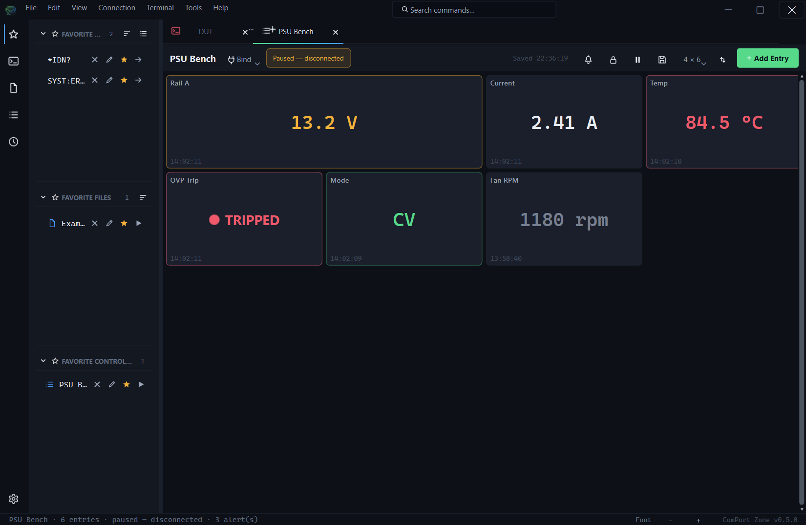
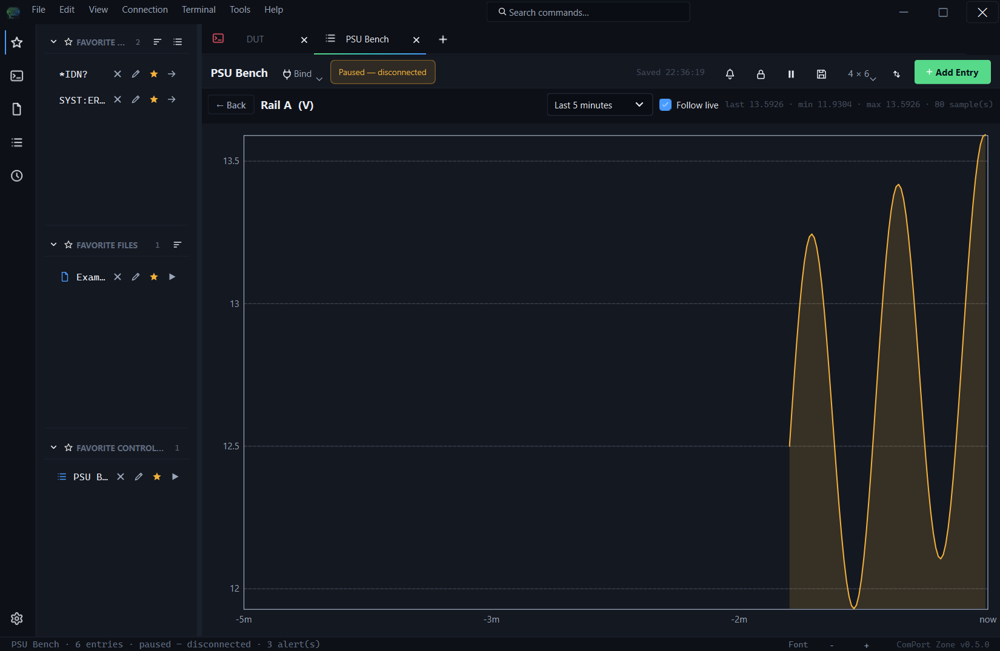
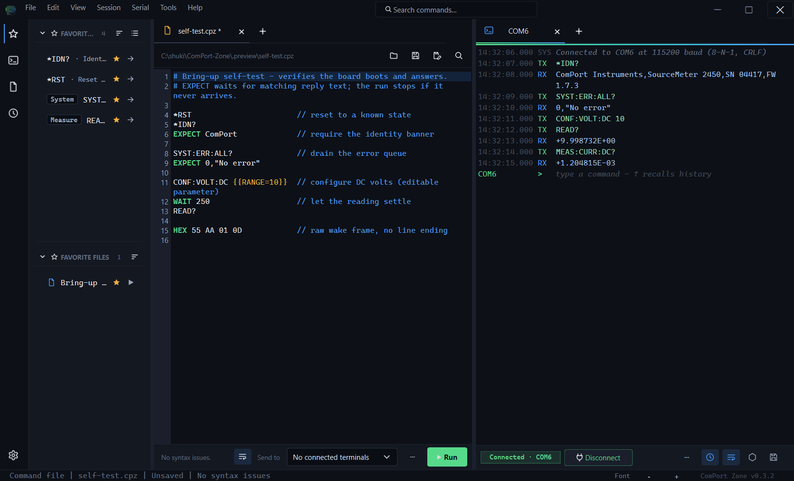
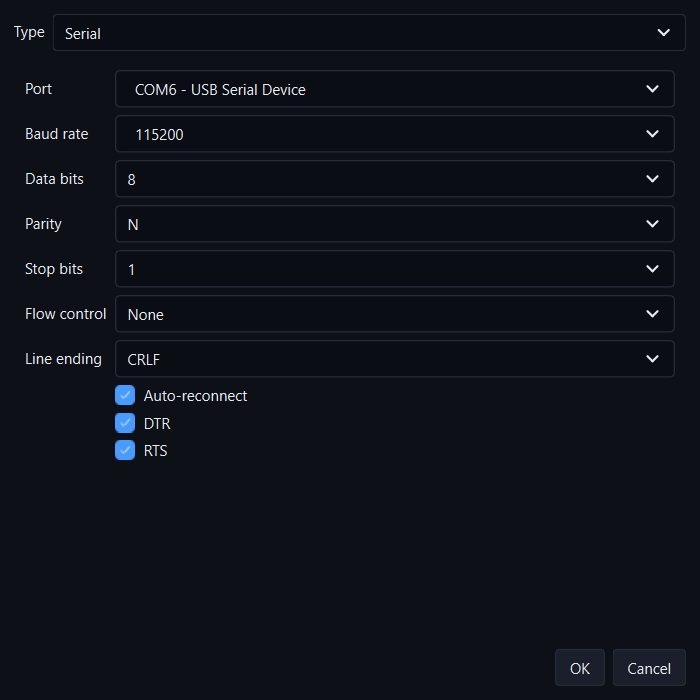
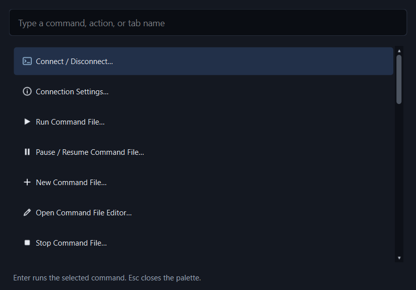

<div align="center">

# ComPort Zone

**A modern serial terminal and device-automation workbench for Windows.**

Connect to COM ports and TCP endpoints, watch traffic in a structured terminal, fire off saved commands, and run repeatable command files — in an IDE-style desktop app or a matching headless CLI.




</div>

## What it's for

ComPort Zone is built for the work that happens on a bench: bringing up a new board, debugging firmware over a serial console, talking to instruments and power supplies, and running the same verification steps over and over. It pairs a fast, readable terminal with a saved-command library and a small command-file language, so the manual probing you do once becomes a script you can re-run forever — and the same engine is available headless for CI and automation.

- **Terminal-first** — a structured, color-coded terminal with an integrated `TX>` prompt, timestamps, search, and history.
- **Built for repetition** — save commands, star favorites, and codify sequences into runnable command files with waits and response checks.
- **Serial and network** — RS-232 / USB-serial COM ports and raw TCP/LAN endpoints share the same workflow.
- **One tool, two faces** — a polished PySide6 desktop app and a `comport-zone` CLI that share the same settings.

## Features

### A structured, live terminal

Every byte is laid out in clean columns — timestamp, direction, and message — with TX in green, RX in blue, and errors and system notices clearly distinguished. Type after the `TX>` prompt and press **Enter** to send; recall earlier commands with the **Up/Down** arrows; autocomplete from history and saved commands with **Ctrl+Space**. Open multiple tabs for independent sessions, search within the active terminal, toggle hex/text display, and zoom with **Ctrl + mouse wheel**.

<div align="center">

</div>

### Quick commands, favorites, and history

Keep the commands you use most one click away. The left drawer carries four curated views: **Favorites** (your starred commands and files), **Saved Commands** (the full library, organized into groups, in text or raw-hex mode), **Files** (saved command-file paths), and **History** (everything you've recently sent — re-send it, star it, or promote it to a saved command). Import and export libraries as CSV to share them across machines and teammates.

<div align="center">

</div>

### Command-file automation and a built-in editor

Turn a manual sequence into a repeatable script. Command files run top to bottom and understand a small, readable DSL — `SEND`, `WAIT`, `HEX`, and `EXPECT` for response assertions, plus `{{parameters}}` you fill in at run time. Run them from a terminal tab, the drawer, or the CLI, with **Pause / Resume / Stop** controls and a status line.

The integrated editor opens command files as workspace tabs with line numbers, syntax highlighting, autocomplete, optional unknown-command warnings, find-and-replace, and a one-click run bar that targets any connected session.

<div align="center">

</div>

### Control Panel: monitor and drive your gear

Build a control panel of the values you keep checking — voltages, temperatures, fault flags — and let it poll them in the background. Each tile is one command with its own interval, response parse rule (first line or a regex capture), and ordered color rules that turn the tile green/amber/red from the reply; LED tiles make GO/NO-GO states readable across the room, control tiles (button or toggle) *send* on click for ON/OFF rails or zeroing offsets, **setpoint tiles** drive a slider+field with optional readback for analog setpoints, **enum tiles** offer dropdown mode selection with indicator-follows-readback, and **computed tiles** show derived values like `{Volts} * {Amps}` over your other tiles. Every writing tile is gated by a header **Master Arm** toggle — the panel boots disarmed, Esc disarms instantly, and unbinding force-disarms. Numeric tiles paint a 120 s sparkline under the value; double-click any one to open a full chart page with span presets (1/5/30/60 min) and a hover crosshair. A control panel binds to one of your open terminal tabs and shares its connection — or, with per-entry overrides, one panel can drive **multiple devices at once**. Poll traffic stays out of the transcript so the terminal remains yours for manual commands; polling pauses automatically while the port is disconnected or a command file is running, and resumes by itself. Transitions into FAIL/ERROR ring a bell with an unseen badge, flash the taskbar, and (optionally) play a short tone — silenceable per tile or globally. Optional CSV logging captures every parsed value (and every control send, marked with a `kind` column) for unattended runs and audit. Arrange tiles on a drag-and-drop grid (with 2×1/2×2 sizes), keep named control panels in your library and the drawer's Control Panels page, star favorites, share them as JSON, and they restore with your workspace — `File > New Control Panel` or **Ctrl+Shift+D** to manage them.

<div align="center">

</div>

<div align="center">

</div>

### A workspace that splits

Drag tabs into side-by-side or stacked panes to watch a terminal while you edit the script that drives it, or compare two devices at once. The drawer, themes, terminal font, and settings stay consistent across panes.

<div align="center">

</div>

### Serial and TCP connectivity

Full control over the serial line — port, baud rate, data bits, parity, stop bits, flow control, DTR/RTS, line ending, and auto-reconnect — or point a tab at a raw TCP host/port for LAN-connected gear. Connection settings open per tab, and a status bar always shows the active endpoint's state.

<div align="center">

</div>

### Keyboard-first, with a command palette

Press **Ctrl+Shift+P** to jump to any action — connect, run a command file, split the workspace, open settings — without leaving the keyboard. Six built-in themes (including ComPort Zone Dark/Light, VS Code Dark, and Windows Terminal) and adjustable terminal fonts let you make it yours.

<div align="center">

</div>

### A headless CLI

Everything that matters for automation is scriptable. `comport-zone` shares the GUI's settings and exposes ports, one-shot sends, listening, command-file runs, quick libraries, history, and an interactive REPL — with stable exit codes for CI. The connect-using commands take a **serial COM port** (`--port`) or a **raw TCP endpoint** (`--host` / `--tcp-port`); the two are kept distinct so they never collide.

```powershell
comport-zone send "*IDN?" --port COM6 --read-after 500
comport-zone run bringup.cpz --port COM6 --param RANGE=10
comport-zone listen --host 192.168.1.50 --tcp-port 5025 --timestamps --duration 10
```

See [`docs/CLI_REFERENCE.md`](docs/CLI_REFERENCE.md) for the full command, flag, and exit-code reference (serial and raw TCP), plus a TCP echo-server smoke test.

## Getting started

### Install

After cloning the repository, run the setup script:

```powershell
.\setup_dev.bat
```

It creates or reuses a `.venv`, installs ComPort Zone in editable mode with its dependencies, and runs the test suite. Useful flags: `-SkipTests`, `-WithBuild`, `-RecreateVenv`.

Prefer to do it by hand?

```powershell
python -m venv .venv
.venv\Scripts\Activate.ps1
python -m pip install -e .
```

### Run

```powershell
.\launch_app.bat
```

Once installed, the console script also launches the desktop app:

```powershell
comport-zone
```

> **Looking for a ready-to-run build?** Releases ship a Windows installer (`ComPort_Zone-X.Y.Z-win64-setup.exe`) and a portable zip — no Python required. See [Building a Windows executable](#building-a-windows-executable).

## Command files

Plain-text command files (run from a terminal tab's **Run** button, the drawer, or `comport-zone run`) send each non-empty line as a command. They also support a small DSL:

```text
# Comment, or // C-style comment
*IDN?                       // a bare line is sent as-is
SEND version                // same as a bare line
WAIT 1000                   // pause 1000 ms before the next step
EXPECT ComPort              // require matching RX text before continuing
HEX 55 AA 01 0D             // send raw bytes, no line ending
```

- **`SEND <text>`** sends text with the active line ending; a bare line does the same.
- **`WAIT <ms>`** pauses before the next step.
- **`HEX <bytes>`** sends raw bytes with no line ending.
- **`EXPECT <text>`** waits (up to one second, unless `@@expect-timeout` changes it) for RX text containing `<text>`; if it doesn't arrive, the run stops with an error. RX is still shown in the terminal, and matches can span multiple chunks.

### Settings (`@@`)

`@@` directives set execution properties that persist from that line to the end of the run (or until the same one is set again). They must start the line and are never sent to the device:

```text
@@wait 200            # pause 200 ms before each following command
@@expect-timeout 2000 # give EXPECT up to 2000 ms (default 1000)
@@on-error continue   # a failed step logs a warning instead of stopping the run
@@send-mode hex       # read following bare / SEND lines as raw hex bytes
```

- **`@@wait <ms>`** delays before every following command (`0` disables).
- **`@@expect-timeout <ms>`** sets the timeout for following `EXPECT` steps.
- **`@@on-error <stop|continue>`** aborts on a failed step (default `stop`) or logs it and keeps going.
- **`@@send-mode <text|hex>`** interprets following bare/`SEND` lines as text (default) or raw hex bytes; `HEX`/`EXPECT`/`WAIT` are unaffected.

### Parameters

Prompt for values before a run, with optional defaults:

```text
VOLT {{VOLT_VALUE}}            # asked for at run time
CURR {{CURR_VALUE=1.00}}       # pre-filled with 1.00
HEX  {{WAKE_BYTES=55 AA 01 0D}}
```

A value entered once is reused for every later occurrence in the same run. Parameters work in bare lines, `SEND`, `WAIT`, `HEX`, and `EXPECT`.

## CLI reference

Run `comport-zone` with no arguments (or `gui`) for the desktop app, or a subcommand for headless work. All commands share the GUI's `%LOCALAPPDATA%\ComPortZone\settings.json`.

| Command | Purpose |
| ------- | ------- |
| `ports list` / `ports info COM3` | List COM ports or inspect one. |
| `send "*IDN?" --port COM3 --read-after 500` | Send text once, optionally wait for RX. |
| `hex 55 AA 01 0D --port COM3` | Send raw bytes. |
| `listen --port COM3 --timestamps --duration 10` | Stream RX as text or hex, with optional logging. |
| `run file.cpz --port COM3 --param NAME=VALUE` | Run a command file with parameters. |
| `validate file.cpz` | Parse-check a command file. |
| `quick list` / `quick send LABEL --port COM3` | Manage and send saved commands. |
| `files list` / `files run LABEL --port COM3` | Manage and run saved command files. |
| `settings show --section app` | Inspect, set, export, or import settings. |
| `history list --limit 20` | List or clear command history. |
| `update check` | Compare the local build against the latest GitHub release. |
| `repl --port COM3` | Open an interactive serial REPL. |

Global options include `--json`, `--no-color`, `--quiet`, `--verbose`, and `--config PATH`. Serial commands accept shared connection flags (`--port`, `--baud`, `--data-bits`, `--parity`, `--stop-bits`, `--flow-control`, `--line-ending`, `--dtr`, `--rts`, `--auto-reconnect`). Exit codes are stable: `0` OK, `1` error, `2` usage, `10` port busy, `11` EXPECT failed, `12` missing parameter, `13` parse error, `14` port not found, `15` settings error, `130` interrupted.

## Keyboard shortcuts

| Shortcut | Action | | Shortcut | Action |
| -------- | ------ |-| -------- | ------ |
| `Ctrl+T` | New tab | | `Enter` | Send the `TX>` draft |
| `Ctrl+Shift+T` | Duplicate tab | | `Shift+Enter` | New line in the draft |
| `Ctrl+W` | Close tab | | `Up` / `Down` | Navigate history |
| `Ctrl+Shift+P` | Command palette | | `Ctrl+Space` | Autocomplete |
| `Ctrl+B` | Toggle drawer | | `Ctrl+F` | Search terminal |
| `Ctrl+\` | Split tab right | | `Ctrl+K` | Clear terminal |
| `Ctrl+Enter` | Connect / disconnect | | `Ctrl+=` / `Ctrl+-` | Terminal font size |

## Configuration and data

ComPort Zone autosaves to `%LOCALAPPDATA%\ComPortZone\settings.json`, written atomically with a `settings.json.bak` fallback if the primary file is ever corrupt. Settings cover transport defaults, restored tabs and their state, the split-workspace layout, theme, terminal font, history, and drawer state.

- **App settings** import/export as a versioned JSON file via `File > App Settings Import / Export…`.
- **Quick Commands** and **Quick Files** are action libraries with their own CSV import/export (append or replace, with duplicate skipping) from the drawer or the `Tools` menu.

## Building a Windows executable

Bump the version, then build the installer and portable zip:

```powershell
.\update_version.bat -Bump patch
.\build_exe.bat
```

`build_exe.bat` runs PyInstaller in one-folder mode, embeds Windows version properties, and (with [Inno Setup 6](https://jrsoftware.org/isinfo.php) installed) produces an installer. Output lands in `release\ComPort_Zone-X.Y.Z-win64\`, `…-win64.zip`, and `…-win64-setup.exe`. The installer is per-user and preserves your `settings.json` across upgrades.

## Development

- Run the tests: `.\run_tests.bat` (or a focused module, e.g. `.\run_tests.bat tests.test_quick_actions`).
- Architecture and design notes live in [`docs/ARCHITECTURE.md`](docs/ARCHITECTURE.md), [`docs/DESIGN.md`](docs/DESIGN.md), and [`docs/LLM_CHANGE_GUIDE.md`](docs/LLM_CHANGE_GUIDE.md).
- Release history is in [`CHANGELOG.md`](CHANGELOG.md) and [`RELEASE_NOTES.md`](RELEASE_NOTES.md).
- CI runs the Windows test suite on every push and pull request; tagged commits build and publish the release artifacts.

## Third-party notices

The bundled icon subset comes from [Tabler Icons](https://tabler.io/icons) under the MIT license. See [`THIRD_PARTY_NOTICES.md`](THIRD_PARTY_NOTICES.md).
