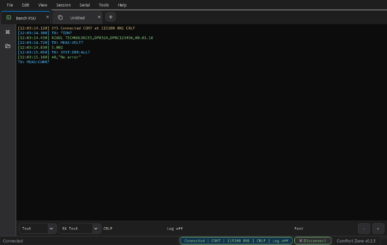
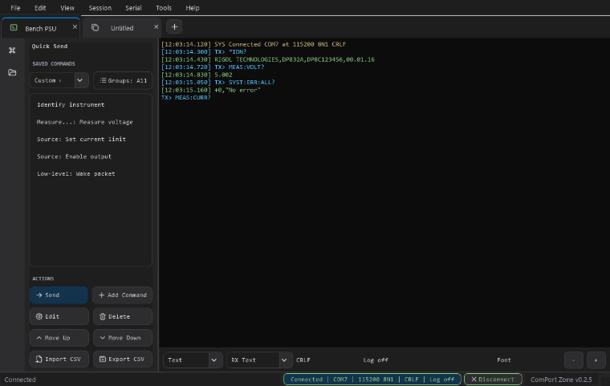

# ComPort Zone

ComPort Zone is a Windows-first COM-port terminal for device bring-up, debugging, and repeated engineering command workflows.

The current UI is terminal-first: a menu bar, Windows Terminal-style tabs, one large terminal surface with an integrated `TX> ` command prompt, a compact control bar, and a foldable left drawer for quick commands and quick files.

Current version: `0.3.1`.

## UI Preview

These screenshots and GIFs are captured from the current PySide UI with sample serial data, so GitHub reviewers can see the real application surface while reading the code.

### Screenshots

<p>
  
</p>

<p>
  
</p>

### GIFs

<p>
  
</p>

<p>
  
</p>

## Current Features

- Terminal-first layout with minimal chrome and a VS Code dark default theme
- Bundled Tabler Icons subset for richer, modern, MIT-licensed UI icons
- Tabs for independent serial sessions and command-file editor documents
- Split workspace panes for side-by-side or stacked terminal/editor tabs, with drag-to-pane movement and join controls
- Foldable and resizable left drawer, collapsed by default, with shared width and selected page across terminal and editor tabs
- Quick-send commands with add, edit, delete, reorder, groups, text mode, hex mode, optional descriptions, optional line-ending override, and CSV import/export
- Separate quick-file drawer entry for saved command-file paths, with sorting, drag/manual reorder, double-click/send execution, Explorer reveal, and CSV import/export
- Built-in command-file editor tabs with line numbers, autocomplete, syntax highlighting, unknown-command warnings, dirty-state tab indicators, file save/open, and explicit run targets
- Serial settings with COM port, baud rate, data bits, parity, stop bits, flow control, DTR, RTS, auto-reconnect, and line ending
- Raw TCP LAN terminal sessions with host/port endpoint settings, text and hex sends, and shared terminal workflows
- Headless `comport-zone` CLI for ports, send/listen, command files, quick libraries, settings, history, updates, and REPL workflows
- App settings import/export as JSON files instead of an internal profile list
- App settings import/export includes transport defaults, theme, terminal font, history, drawer state, split workspace layout, log/script paths, restored tabs, and workflow preferences
- Help menu update checks against the latest GitHub release, with an optional startup check preference
- Serial Settings opens automatically for the active tab on launch and for each new blank tab
- Connect, disconnect, refresh ports, and reconnect feedback
- Text and hex/raw-byte sending from the integrated `TX> ` prompt, plus receive display modes
- Up/Down command history navigation
- Autocomplete from command history and saved quick commands with `Ctrl+Space`
- Search within the active terminal tab with highlighted matches
- RX, TX, status, and error coloring
- Optional terminal timestamps
- Clear, copy, select all, pause/resume output, terminal font settings, Ctrl+mouse-wheel zoom, and line wrap controls
- Terminal output context menu with Clear Terminal, Line Wrap, Show Timestamps, and selected text/hex show/replace helpers
- Per-tab command file execution with `SEND`, `WAIT`, `HEX`, and response assertions via `EXPECT`
- Per-tab logging to text files
- Persisted settings for theme, drawer state and page, transport defaults, quick commands, font size, history, scrollback, restored tabs, and split workspace layout
- Atomic local settings saves with a backup fallback if the primary settings file is corrupt or invalid

## Install

After cloning the repository, run the setup script:

```powershell
.\setup_dev.bat
```

The script creates or reuses `.venv`, installs the packaging backend, installs ComPort Zone in editable mode, installs dependencies from `pyproject.toml`, and runs the test suite.
Pip temp files and cache are kept under `build\setup` so setup does not depend on the user's `%LOCALAPPDATA%\Temp` permissions.

Useful setup options:

```powershell
.\setup_dev.bat -SkipTests
.\setup_dev.bat -WithBuild
.\setup_dev.bat -RecreateVenv
.\setup_dev.bat -NoPipUpgrade
.\scripts\setup_dev.ps1 -DryRun
```

Manual setup is still possible:

```powershell
python -m venv .venv
.venv\Scripts\Activate.ps1
python -m pip install -e .
```

## Run

```powershell
.\launch_app.bat
```

PowerShell users can call the underlying script directly:

```powershell
.\scripts\launch_app.ps1
```

The script prefers `.venv\Scripts\python.exe` when it exists, falls back to `py -3.12` or `python`, and prepends `src` to `PYTHONPATH` for local source runs.

The raw module command still works:

```powershell
.\.venv\Scripts\python.exe -m ComPort_Zone
```

After installation, the console script can also launch the app:

```powershell
comport-zone
```

## CLI

Run `comport-zone` without arguments, or with `gui`, to launch the desktop app. Pass a subcommand for headless workflows that share the same `%LOCALAPPDATA%\ComPortZone\settings.json` settings as the GUI.

Global options:

| Option | Description |
| ------ | ----------- |
| `--json` | Emit machine-readable output where supported. |
| `--no-color` | Disable ANSI colors. |
| `--quiet` | Suppress status messages. |
| `--verbose` | Include debug events. |
| `--config PATH` | Use a specific `settings.json` file. |

Serial commands accept shared connection flags: `--port`, `--baud`, `--data-bits`, `--parity`, `--stop-bits`, `--flow-control`, `--line-ending`, `--dtr`, `--rts`, `--auto-reconnect`/`--no-auto-reconnect`, and `--wait`.

Common CLI commands:

| Command | Purpose |
| ------- | ------- |
| `comport-zone version` | Print app, Python, and pyserial versions. |
| `comport-zone ports list` / `comport-zone ports info COM3` | List COM ports or inspect one port. |
| `comport-zone send "*IDN?" --port COM3 --read-after 500` | Send text once, optionally wait for RX. |
| `comport-zone hex 55 AA 01 0D --port COM3` | Send raw bytes. |
| `comport-zone listen --port COM3 --timestamps --duration 10` | Stream RX as text or hex, with optional filtering/logging. |
| `comport-zone run file.txt --port COM3 --param NAME=VALUE` | Run a command file with parameter support. |
| `comport-zone validate file.txt` | Parse-check a command file. |
| `comport-zone quick list` / `comport-zone quick send LABEL --port COM3` | Manage and send Quick Commands. |
| `comport-zone files list` / `comport-zone files run LABEL --port COM3` | Manage and run Quick Files by label, id, or path. |
| `comport-zone settings show --section app` | Inspect, set, export, or import app settings. |
| `comport-zone history list --limit 20` | List or clear command history. |
| `comport-zone update check` | Compare the local build against the latest GitHub release. |
| `comport-zone repl --port COM3` | Open an interactive serial REPL. |

Stable CLI exit codes are `0` OK, `1` generic error, `2` usage error, `10` port busy, `11` EXPECT failed, `12` missing parameter, `13` parse error, `14` port not found, `15` settings error, and `130` interrupted.

## Test

Run the full test suite:

```powershell
.\run_tests.bat
```

Run a focused test module or class:

```powershell
.\run_tests.bat tests.test_quick_actions
.\run_tests.bat tests.test_app_sessions.AppSessionTests.test_rename_tab_updates_title
```

PowerShell users can call:

```powershell
.\scripts\run_tests.ps1
.\scripts\run_tests.ps1 tests.test_quick_actions
```

## Developer Documentation

- `docs/ARCHITECTURE.md`: current refactor state, subsystem ownership, and roadmap.
- `docs/DESIGN.md`: detailed design reference with module maps, data/control flows, and test guidance.
- `docs/LLM_CHANGE_GUIDE.md`: compact ownership map and safe change recipes for small fixes.
- `CHANGELOG.md` and `RELEASE_NOTES.md`: release history and user-facing change summaries.

## CI/CD

GitHub Actions runs the Windows CI workflow on pushes and pull requests targeting `master` or `main`.
The CI job installs the editable package through `scripts\setup_dev.ps1`, runs the `unittest` suite with `scripts\run_tests.ps1`, and checks installed package dependencies.

The release workflow builds the Windows PyInstaller one-folder zip package and installer on matching version tags and manual dispatches.
To publish a GitHub Release, update the version files, update release docs, commit the change, create an annotated tag that matches `src\ComPort_Zone\VERSION`, and push it. The tag message file should include the change list since the previous version.

```powershell
.\update_version.bat -Version 1.2.3
git add -A
git commit -m "Release v1.2.3"
git tag -a v1.2.3 -F build\release-v1.2.3-tag.md
git push origin master
git push origin v1.2.3
```

Manual release workflow runs build and upload the Windows zip and installer as workflow artifacts without publishing a GitHub Release unless the run is for a tag.
Annotated release tags should include the change list since the previous version so the generated GitHub Release can be verified against the intended notes.

## Build Windows EXE

Update the app version before a release:

```powershell
.\update_version.bat -Version 1.2.3
.\update_version.bat -Bump patch
.\update_version.bat -Bump minor
.\update_version.bat -Bump major
```

Double-click `build_exe.bat` from the project folder. Install Inno Setup 6 first so the script can create the Windows installer.

The script creates or reuses `.venv`, installs the app with build dependencies, runs PyInstaller in `onedir` mode, embeds Windows file-version properties, builds an Inno Setup installer, and writes publishable output to:

```text
release\ComPort_Zone-X.Y.Z-win64\
release\ComPort_Zone-X.Y.Z-win64.zip
release\ComPort_Zone-X.Y.Z-win64-setup.exe
```

The generated executable is also available at:

```text
dist\ComPort Zone\ComPort Zone.exe
```

The publish folder keeps the PyInstaller bundle under `app\`. Installer users do not run from that folder directly; they run `release\ComPort_Zone-X.Y.Z-win64-setup.exe`, which installs a normal per-user Windows app with Start Menu and desktop shortcuts.

The installer writes the frozen app internals to:

```text
%LOCALAPPDATA%\ComPortZone\app\
```

The local settings file remains beside that app folder:

```text
%LOCALAPPDATA%\ComPortZone\settings.json
```

The installer uses a stable AppId and replaces only the installed `app\` bundle on every install, so upgrades and downgrades remove stale PyInstaller files while preserving `settings.json`, `settings.json.bak`, the uninstaller, and user data.

After the first setup, later builds skip dependency installation when the `.venv` build environment is already ready. To force a dependency refresh, run:

```powershell
powershell -NoProfile -ExecutionPolicy Bypass -File scripts\build_exe.ps1 -ForceInstall
```

To build only the portable one-folder zip without the installer:

```powershell
powershell -NoProfile -ExecutionPolicy Bypass -File scripts\build_exe.ps1 -SkipInstaller
```

## Terminal Input

Terminal tabs use an integrated `TX> ` draft at the bottom of the terminal surface. Type after the prompt and press Enter to send the draft using the selected send mode.

- Enter sends the current draft.
- Shift+Enter inserts a new line into the draft.
- Up and Down navigate command history.
- Ctrl+Space opens autocomplete from command history and quick commands.
- Shift+Delete removes the current draft from command history when it matches a saved history entry.
- Ctrl+mouse wheel adjusts the terminal font size.

Committed RX, TX, status, and error transcript text is protected from normal typing. The terminal context menu can still show or replace selected transcript text as hex/text when you explicitly choose those actions.

## Batch Script Format

Plain text files can be run from `Tools > Command Files > Run Command File` or saved in the left drawer as quick files. Every non-empty bare line is sent as a command with the active session line-ending setting.

Use `Tools > Command Files > New Command File` or `Tools > Command Files > Open Command File Editor` to create and edit command files as workspace tabs inside ComPort Zone. Quick Files can also be opened in an editor tab from `Tools > Quick Files > Edit Selected File` or from the Quick Files right-click menu. The editor supports:

- Autocomplete from batch keywords, comments, known commands, command history, quick commands, and words already used in the current command file
- Quick-command suggestion filtering by group
- Syntax highlighting for batch keywords, comments, parameters, and invalid command-file syntax
- Optional unknown-command warnings, where the first command token is checked before arguments, so `SINK:CURR 4.5` validates against `SINK:CURR`
- New, Open, Save, and Save As actions, with validation running in the background
- Find and replace with `Ctrl+F`, `Ctrl+H`, next/previous navigation, case-sensitive search, replace current, and replace all
- Dirty tab indicators: unsaved files show `*`; validation errors color the tab as an error
- Multiple command files open at the same time
- Editor font zoom through the toolbar buttons or `Ctrl` + mouse wheel
- Editor-side quick drawer matches the terminal quick drawer: quick commands insert at the cursor, quick files open into the editor, and quick-command suggestions follow the active quick-command filter
- `Ctrl+S` saves the current command file, and `Ctrl+Shift+S` opens Save As
- Bottom editor run bar with a connected-COM dropdown and Send button
- Running unsaved editor content through the same command-file engine used by Quick Files
- Explicit execution from `Run in Terminal > <connected COM port>`, available from the command-file menu and editor-tab context menu

The parser also supports a small batch DSL:

```text
# Comment
// C-style comment
SEND version
WAIT 1000 // Pause one second
EXPECT ComPort Zone // Require matching received text before continuing
HEX 55 AA 01 0D // Send raw bytes
reset // Bare command
```

- `SEND <text>` sends text with the active line ending.
- `WAIT <milliseconds>` pauses before the next step.
- `HEX <bytes>` sends raw bytes without appending a line ending.
- `EXPECT <text>` waits up to one second for received text containing `<text>`. If the text is not received, the command file stops with an error.
- Bare lines are treated like `SEND`.
- `//` starts a single-line comment. Everything after it is ignored until the next line.
- `EXPECT` observes RX data without hiding it from the terminal, and it can match responses that arrive in multiple chunks.

### Command File Parameters

Command files can include simple runtime parameters:

```text
VOLT {{VOLT_VALUE}}
CURR {{CURR_VALUE=1.00}}
WAIT {{DELAY_MS=10}}
HEX {{WAKE_BYTES=55 AA 01 0D}}
```

- `{{PARAM}}` appears in the pre-run parameter window with an empty value.
- `{{PARAM=default}}` appears in the pre-run parameter window with `default` already filled in.
- Parameter names may use letters, numbers, and underscores, and must start with a letter or underscore.
- Before a parameterized file starts, ComPort Zone lets you set or override parameter values.
- If a value is left empty, or a prefilled default is deleted, ComPort Zone asks for that value when execution reaches the line.
- Values are remembered for the current run. If `{{VOLT_VALUE}}` appears again later, the first entered value is reused automatically.
- Parameters work in bare commands, `SEND`, `WAIT`, `HEX`, and `EXPECT` lines.

## Quick Commands CSV Format

Quick commands can be exported from `Tools > Quick Commands > Export CSV`, imported from `Tools > Quick Commands > Import CSV`, or managed directly from the Quick Send drawer actions.

During import, choose whether to append incoming commands to the current list or replace the current list.
The import dialog can also skip duplicates, where duplicates are matched by group, title, command text, and send mode.
Export writes UTF-8 CSV with these columns:

| Column                 | Required | Description                                                                                                    |
| ---------------------- | -------- | -------------------------------------------------------------------------------------------------------------- |
| `label`                | No       | Display name shown in Quick Send. If empty, the command text is used.                                          |
| `command`              | Yes      | Text command or hex byte sequence to send.                                                                     |
| `description`          | No       | Optional hover text for the saved command.                                                                     |
| `send_mode`            | No       | `Text` or `Hex Bytes`. Invalid or empty values default to `Text`.                                              |
| `group`                | No       | Group name used for sorting and show/hide filtering. Empty values become `General`.                            |
| `line_ending_override` | No       | Optional text-mode line ending override: `None`, `CR`, `LF`, or `CRLF`. Empty uses the active session setting. |

Example:

```csv
label,command,description,send_mode,group,line_ending_override
Read Version,version,Read firmware version,Text,General,CRLF
Boot Wake,55 AA 00,Send bootloader wake bytes,Hex Bytes,Boot,
Read ID,id?,Read factory identity string,Text,Factory,LF
```

## Quick Files CSV Format

Quick files are saved command-file paths shown in the left drawer. They can be exported from `Tools > Quick Files > Export CSV`, imported from `Tools > Quick Files > Import CSV`, or managed directly from the Quick Files drawer actions.

During import, choose whether to append incoming files to the current list or replace the current list.
The import dialog can also skip duplicates, where duplicates are matched by file path.
Export writes UTF-8 CSV with these columns:

| Column  | Required | Description                                                                           |
| ------- | -------- | ------------------------------------------------------------------------------------- |
| `label` | No       | Display name shown in Quick Files. If empty, the file name is used during import.     |
| `path`  | Yes      | Path to the command file to run. The app stores the path as written in the CSV file.  |

Import also accepts `title` as an alias for `label`, and `file`, `command_file`, or `script` as aliases for `path`.

Example:

```csv
label,path
Bring-up,C:/scripts/bringup.txt
Factory Check,C:/scripts/factory-check.scr
Smoke Test,C:/scripts/smoke-test.cmd
```

## App Settings JSON

The app autosaves the current setup to:

```text
%LOCALAPPDATA%\ComPortZone\settings.json
```

Local autosaves are written through a temporary file and the previous valid payload is retained at:

```text
%LOCALAPPDATA%\ComPortZone\settings.json.bak
```

If the primary settings file is corrupt or uses an unsupported schema, startup tries the backup before falling back to defaults.

Use `File > App Settings Import / Export...` to open the App Settings dialog, then choose whether to import or export a JSON app-settings file. This replaces the older idea of managing named profiles inside the app.

App settings JSON is versioned with `schema_version: 4`, declares `minimum_compatible_schema_version: 2` when the payload is backward-compatible, and is grouped into `transport`, `app`, `history`, `libraries`, and `workspace` sections. Older flat app-settings JSON is not migrated.

Compatible upgrades and downgrades keep the local settings file, Quick Commands, and Quick Files because they live under `%LOCALAPPDATA%\ComPortZone`, outside the installed app bundle. If a future release makes a non-backward-compatible settings change, update `MINIMUM_COMPATIBLE_SETTINGS_SCHEMA_VERSION` in `src\ComPort_Zone\models.py`; older builds will treat that payload as unsupported and try `settings.json.bak` before defaults.

Quick Commands and Quick Files are intentionally not included in app-settings JSON import/export. They are action libraries, so they use their own CSV import/export flows from the matching sidebar pages or `Tools > Quick Commands` and `Tools > Quick Files`.

The local autosaved `%LOCALAPPDATA%\ComPortZone\settings.json` still stores Quick Commands and Quick Files so they persist after restart.

App settings JSON includes:

- Transport defaults for new tabs, including serial defaults and LAN endpoint settings
- Restored tabs and each tab's serial settings, terminal text, command draft, and send mode
- Split workspace pane layout, active pane, and splitter sizes
- Command history and autocomplete source data
- Theme, terminal font, line wrap, scrollback, RX display mode, timestamps, and drawer state/page
- Last log/script paths and window size

## Keyboard Shortcuts

- `Ctrl+T`: New tab
- `Ctrl+Shift+T`: Duplicate tab
- `Ctrl+W`: Close tab
- `Ctrl+Shift+P`: Command palette
- `Ctrl+B`: Toggle left drawer
- `Ctrl+\`: Split the active tab to the right
- `Ctrl+Enter`: Connect or disconnect
- `Ctrl+F`: Search active terminal
- `Ctrl+K`: Clear terminal
- `Enter`: Send the current terminal `TX>` draft
- `Shift+Enter`: Add a new line to the terminal draft
- `Ctrl+Space`: Autocomplete command input
- `Up` / `Down`: Navigate command history
- `Shift+Delete`: Remove the current draft from command history
- `Ctrl+=` / `Ctrl+-`: Increase or decrease terminal font size

Terminal font family and size can also be changed from `View > Terminal Font Settings`, the terminal command bar, or Ctrl+mouse wheel over the terminal.

## Third-Party Notices

The bundled icon subset comes from Tabler Icons under the MIT license. See `THIRD_PARTY_NOTICES.md`.
