# ComPort Zone Design

## Purpose

This document is the detailed design reference for ComPort Zone. It is meant for developers and small LLM agents that need enough context to make minor changes safely without rediscovering the whole codebase.

Use this document together with:

- `docs/ARCHITECTURE.md` for current refactor status and roadmap.
- `docs/LLM_CHANGE_GUIDE.md` for small, task-focused change recipes.
- `tests/` for executable examples of expected behavior.

Keep this document current when ownership, flows, settings shape, or extension points change.

## Product Summary

ComPort Zone is a PySide6 desktop app for working with serial COM-port devices. The app supports:

- Multiple terminal tabs.
- Serial connection settings and reconnect behavior.
- Integrated `TX> ` terminal prompt with text and hex send modes.
- Timestamped terminal output, search, copy, conversion helpers, and logging.
- Command-file editing, validation, syntax highlighting, autocomplete, find/replace, and execution.
- Batch command files with `SEND`, `WAIT`, `EXPECT`, `HEX`, and parameter templates.
- Quick commands and quick files, shared between terminal and editor views.
- Shared drawer collapsed state, selected page, and width across terminal and embedded editor tabs.
- Import/export of quick actions through CSV.
- App settings import/export through JSON.
- Restored workspace tabs across app launches.
- Manual and default-on launch-time GitHub release checks with clickable release-page links.

Serial is the only implemented transport today, but the design has a transport abstraction so future transports can be added without rewriting UI flows.

## Current High-Level Shape

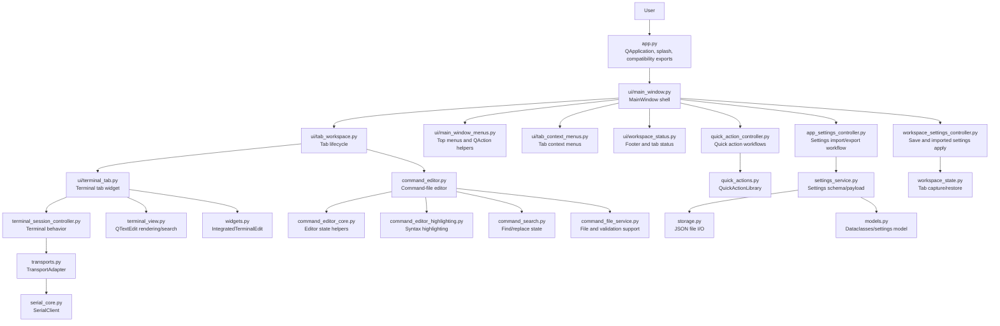

## Dependency Rules

Dependencies should usually point down this stack:

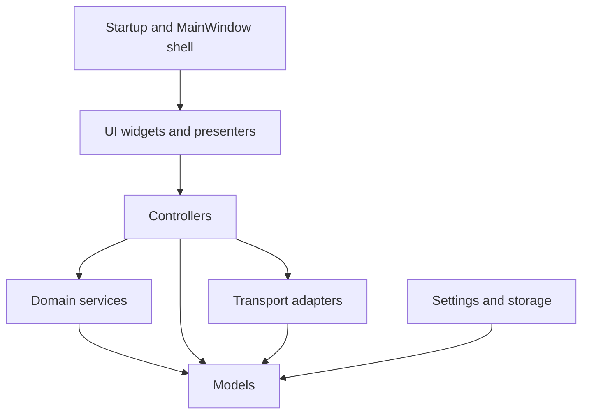

Rules:

- `app.py` should stay small: startup, splash, QApplication setup, and compatibility re-exports.
- `ui/main_window.py` may coordinate top-level wiring, but feature workflows should move to controllers/presenters.
- Qt widgets should not own pure domain behavior when a service can own it.
- Domain modules should not import Qt widgets.
- Controllers may coordinate Qt-facing callbacks, but should avoid direct QTextEdit/QListWidget manipulation where a view/presenter can do it.
- Existing compatibility imports from `ComPort_Zone.app` should be preserved unless intentionally removed.

## Module Ownership Map

| Area | Primary Module(s) | Responsibility |
| --- | --- | --- |
| Startup | `app.py`, `__main__.py` | Create QApplication, splash screen, `MainWindow`, compatibility exports. |
| Main shell | `ui/main_window.py` | Assemble app services, tabs, status bar, top-level commands, compatibility delegates. |
| Top menus/actions | `ui/main_window_menus.py`, `command_registry.py` | Build menus and `QAction`s from command specs. |
| Tab context menus | `ui/tab_context_menus.py` | Build terminal/editor/empty tab right-click menus. |
| Workspace tabs | `ui/tab_workspace.py` | Add, close, duplicate, activate, and enumerate typed tabs. |
| Workspace status | `ui/workspace_status.py` | Tab icons/colors/tooltips and footer connection action state. |
| Terminal tab UI | `ui/terminal_tab.py` | Terminal screen layout, command bar, sidebar integration, user-facing dialogs. |
| Terminal behavior | `terminal_session_controller.py` | Send/run/log/event decisions, pause buffering, batch runner coordination. |
| Terminal rendering | `terminal_view.py` | QTextEdit insertion, rendered event plans, terminal search highlighting. |
| Terminal input widget | `widgets.py` | `IntegratedTerminalEdit` prompt/draft editing, protected transcript behavior, autocomplete navigation, and font-wheel forwarding. |
| Transport abstraction | `transports.py` | `TransportAdapter`, transport events, serial adapter. |
| Serial implementation | `serial_core.py` | Serial port list/connect/read/write/reconnect behavior. |
| Command editor UI | `command_editor.py` | Command-file editor tab/dialog UI and editor-specific wiring. |
| Command editor internals | `command_editor_core.py`, `command_editor_highlighting.py`, `command_search.py` | Editor state, highlighting, find/replace. |
| Command files | `batch.py`, `command_file_service.py`, `command_run_targets.py`, `ui/command_file_targets.py` | Parse/run command files and coordinate run targets. |
| Quick action domain | `quick_actions.py` | Quick command/file CSV, filtering, sorting, reorder, lookup, duplicate rules. |
| Quick action workflows | `quick_action_controller.py` | Add/edit/delete/import/export/reorder UI workflow around `QuickActionLibrary`. |
| Quick action UI | `quick_actions_panel.py`, `quick_actions_sidebar.py` | Shared sidebar/panel used by terminal and editor. |
| Settings | `settings_service.py`, `storage.py`, `workspace_state.py`, `workspace_settings_controller.py` | App settings schema, JSON I/O, workspace capture/restore, save/apply coordination. |
| App settings UI | `app_settings_controller.py`, `ui/dialogs/app_settings_transfer.py` | App settings import/export dialogs and busy workflow. |
| Version checks | `version_check.py`, `ui/dialogs/version_update.py`, `ui/main_window.py` | GitHub release comparison, asynchronous latest-release requests, and the update-available dialog. |
| Dialogs | `ui/dialogs/*` | Focused modal dialogs. |
| Shared UI utilities | `icons.py`, `themes.py`, `widgets.py`, `ui/fonts.py` | Icons, theme palette, custom widgets, font helpers. |
| Tests | `tests/` | Focused module tests plus app-session regression tests. |

## Runtime Composition

At runtime `MainWindow` constructs long-lived services once, then tabs and dialogs use them through callbacks.

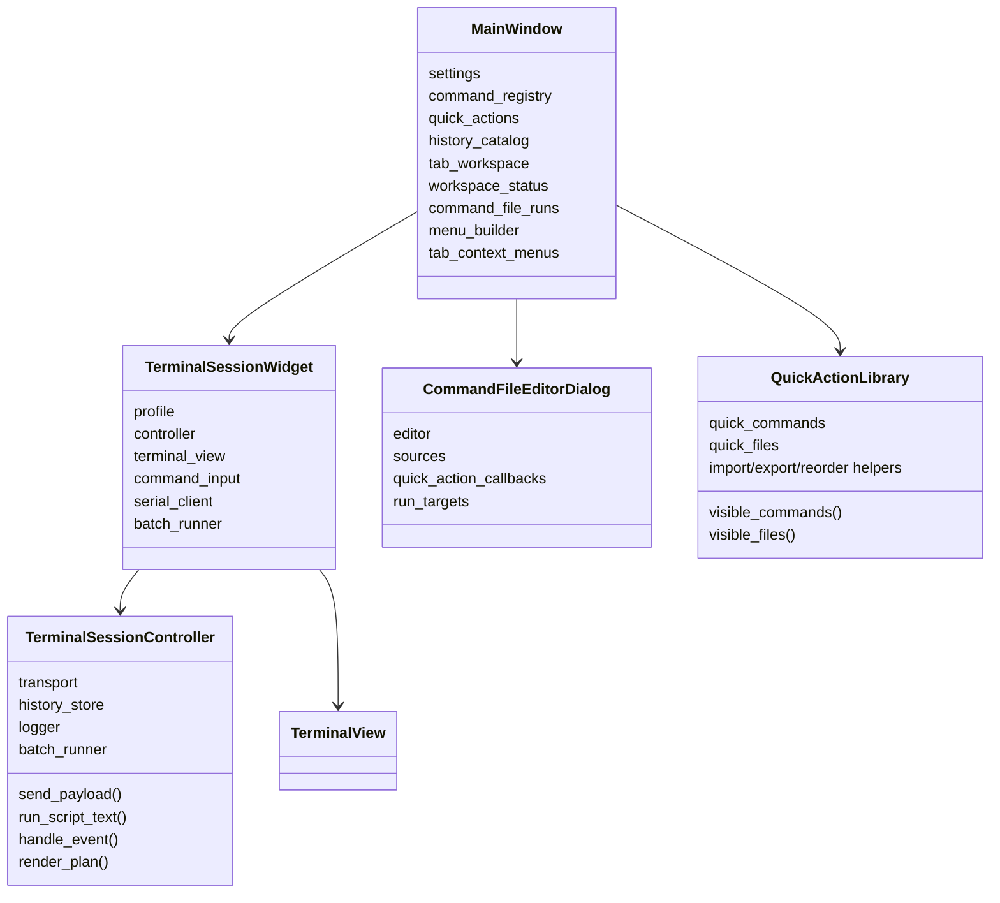

## Core Data Model

The app keeps most persisted state in `models.AppSettings`. The settings service owns the JSON payload shape and schema version. Storage only reads/writes JSON files.

Important model groups:

- `AppSettings`: top-level persisted settings, quick actions, command history, restored tabs, UI preferences, app schema version.
- App-level drawer preferences on `AppSettings`: collapsed state, drawer width, and selected Quick Commands/Quick Files page.
- `TerminalSessionState`: persisted terminal tab state, including title, transport kind/profile, serial profile, terminal text, command draft, send mode, connect-on-launch flag.
- `CommandFileTabState`: persisted command-file editor state, including path, unsaved text, dirty state, send target preference.
- `SerialProfile`: serial connection fields such as port, baudrate, line ending, parity, stop bits, DTR/RTS.
- `QuickCommand`: saved command snippet with label, command text, send mode, group, optional line-ending override.
- `QuickFile`: saved command-file path with label/group metadata.
- `CommandRunTarget`: transient run target shown by editor menus.
- `TransportEvent`, `EndpointInfo`, `TransportProfile`: transport abstraction concepts.

Settings are captured from live runtime tabs through `workspace_state.py`, not by having storage inspect widgets directly.

## Flow: Startup And Restore

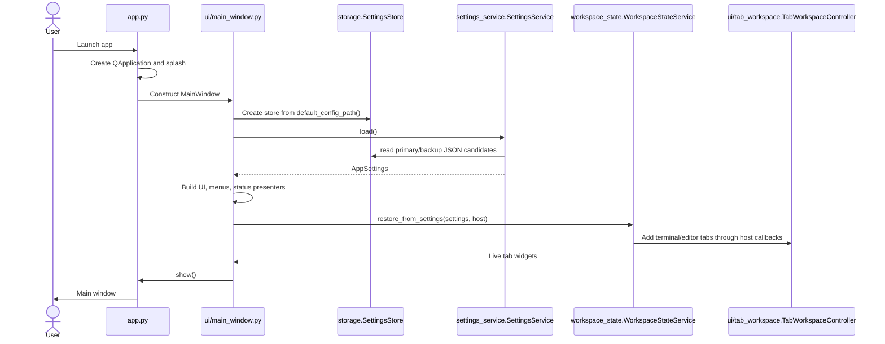

Notes:

- `app.py` re-exports `MainWindow` for compatibility.
- Tests may monkeypatch `ComPort_Zone.app.default_config_path`; `MainWindow.config_path_supplier` preserves this seam.
- Restore should not prompt serial settings for restored tabs unless explicitly requested.
- Restored connected tabs should skip auto-connect and report status when the saved COM port is not currently detected.

## Flow: Terminal Send

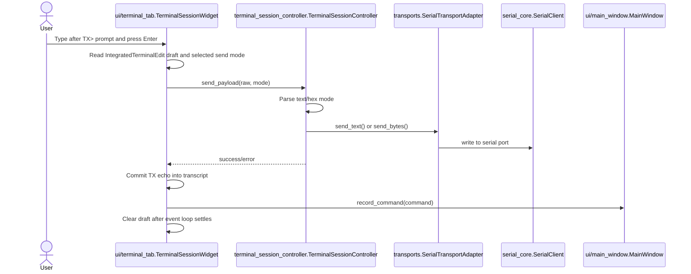

Rules:

- `IntegratedTerminalEdit` owns prompt/draft editing rules and protects committed transcript text from normal editing.
- UI reads current widgets, commits TX transcript text, and shows message boxes.
- Controller owns send parsing and transport call decisions.
- Transport adapter hides `SerialClient` details from higher layers.
- Command history lives in settings through `HistoryStore` and `MainWindow.record_command()`.

## Flow: RX Event Rendering

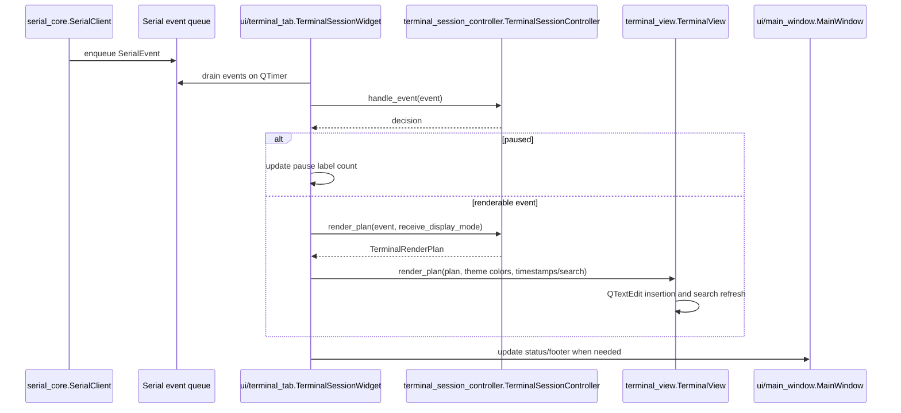

Rules:

- `TerminalSessionController` decides what should happen.
- `TerminalView` applies rendered text to `QTextEdit`.
- `TerminalSessionWidget` coordinates timers and UI labels.

## Flow: Command-File Run

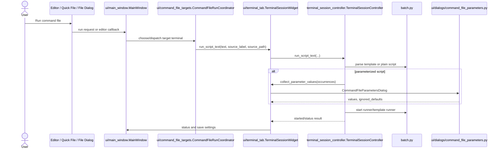

Rules:

- Command parsing/running belongs to `batch.py` and controller code.
- Parameter review dialog is UI-owned in `ui/dialogs/command_file_parameters.py`.
- Connected terminal target menus are coordinated by `ui/command_file_targets.py`.

## Flow: Quick Actions

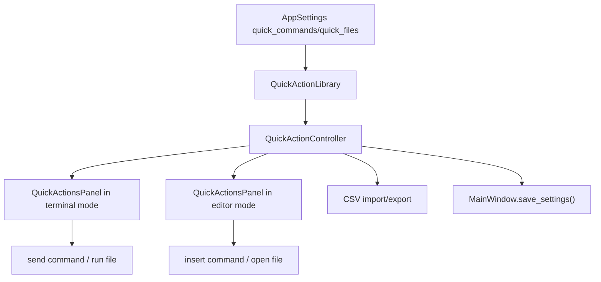

Quick-action rules:

- `quick_actions.py` owns CSV, merge, duplicate, sorting, filtering, group visibility, lookup, and reorder rules.
- `quick_action_controller.py` owns dialogs and mutation workflow.
- `quick_actions_panel.py` and `quick_actions_sidebar.py` render shared UI for terminal and editor modes.
- Terminal and editor sidebars should look the same; only mode-specific primary actions differ.
- Drawer collapsed state, selected Quick Commands/Quick Files page, and drawer width are app-level settings applied across terminal tabs and embedded command-file editor tabs.
- App settings JSON import/export excludes quick actions. Quick actions use CSV import/export.

## Flow: Settings Save, Import, Export

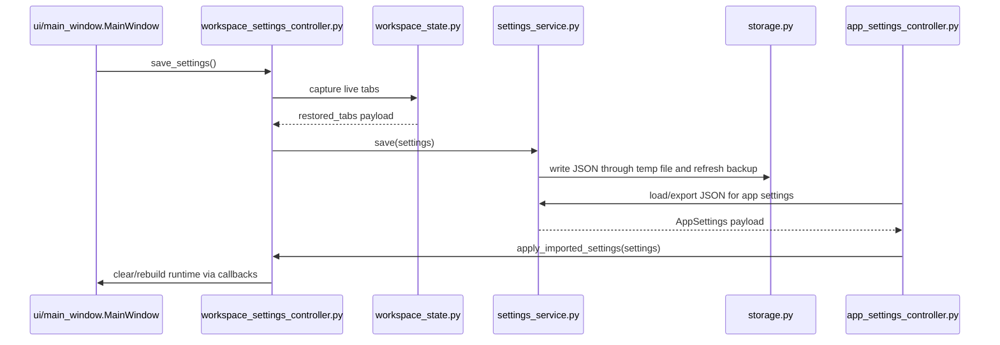

Rules:

- `SettingsService` owns schema and payload rules.
- `SettingsStore` owns file I/O only: temporary-file writes, atomic replacement, backup creation, and primary/backup payload candidates.
- `SettingsService.load()` tries each valid payload candidate before returning default settings. Future payloads are readable only when their `minimum_compatible_schema_version` is not newer than the running app's supported schema.
- `WorkspaceStateService` owns tab capture/restore.
- `WorkspaceSettingsController` coordinates live apply/save through callbacks.
- `AppSettingsController` owns file-picker/dialog/busy UI for JSON settings transfer.

## Flow: Commands, Menus, Palette, Context Menus

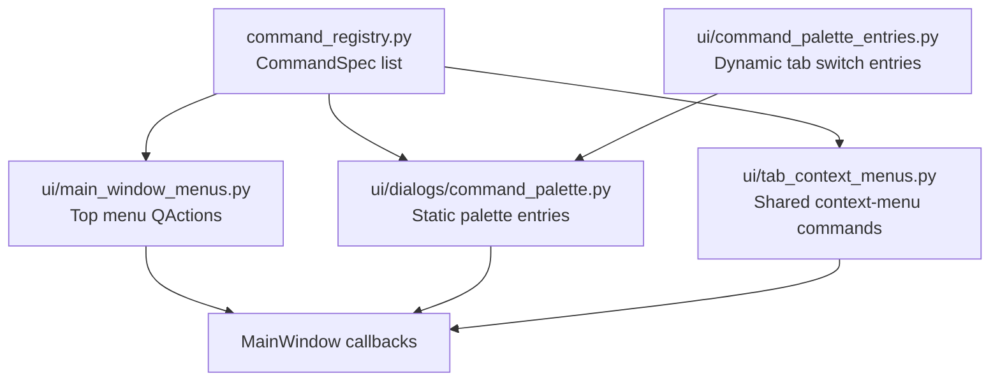

Rules:

- Add shared commands in `command_registry.py`.
- Top menu wiring should stay in `ui/main_window_menus.py`.
- Dynamic tab-switch palette entries should stay in `ui/command_palette_entries.py`.
- Tab context menu composition should stay in `ui/tab_context_menus.py`.
- Selection-specific callbacks may remain local to the menu builder or host callbacks.

## Transport Design

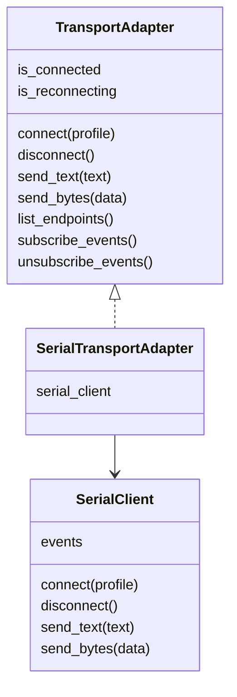

Transport rules:

- UI should talk to `TerminalSessionController`, not directly to future transports.
- New transport work should add adapter(s) behind the `TransportAdapter` protocol.
- Keep serial-specific UI text while serial is the only supported feature.
- Future non-serial settings should extend transport profiles rather than forcing every terminal UI path to know the transport type.

## Dialog Design

Dialogs in `ui/dialogs/*` should be focused and reusable:

- `connection.py`: serial settings dialog.
- `quick_actions.py`: quick command/file edit and import option dialogs.
- `app_settings_transfer.py`: app settings import/export choice.
- `command_palette.py`: command palette.
- `terminal_font.py`: terminal font settings.
- `command_file_parameters.py`: command-file parameter review and prompt bridge.

Dialog rules:

- Dialogs may use Qt widgets freely.
- Dialogs should expose simple result methods, for example `profile()`, `quick_command()`, `options()`, or `values()`.
- Feature services should not import dialogs unless they are explicitly UI workflow controllers.

## Testing Strategy

Standard full suite:

```powershell
.\.venv\Scripts\python.exe -m unittest discover -q
```

Typical focused tests:

| Change Area | Tests |
| --- | --- |
| App startup/main window/session behavior | `tests.test_app_sessions` |
| Top menus/actions | `tests.test_main_window_menus`, command registry tests, related app-session tests |
| Tab context menus | `tests.test_tab_context_menus` |
| Quick action domain | `tests.test_quick_actions` |
| Quick action UI/sidebar/controller | `tests.test_quick_actions_panel`, `tests.test_quick_actions_sidebar`, `tests.test_quick_action_controller` |
| Terminal controller/rendering/input | `tests.test_terminal_session_controller`, `tests.test_terminal_view`, `tests.test_integrated_terminal_input` |
| Command editor | `tests.test_command_editor`, `tests.test_command_editor_core`, `tests.test_command_editor_highlighting`, `tests.test_command_search` |
| Command-file target coordination | `tests.test_command_file_targets`, `tests.test_command_run_targets` |
| Settings/workspace | `tests.test_models_and_storage`, `tests.test_workspace_state`, `tests.test_workspace_settings_controller` |
| Transports/serial | `tests.test_transports`, `tests.test_serial_core` |
| Dialogs | `tests.test_dialogs` |

After docs-only changes, at least run:

```powershell
git diff --check
```

After code changes, run focused tests first, then the full suite.

## Current Refactor State

Done foundations:

- `app.py` is thin startup plus compatibility exports.
- `MainWindow` moved to `ui/main_window.py`.
- Top menu/action wiring moved to `ui/main_window_menus.py`.
- Tab context menus moved to `ui/tab_context_menus.py`.
- Terminal tab moved to `ui/terminal_tab.py`.
- Terminal behavior and rendering split into `terminal_session_controller.py` and `terminal_view.py`.
- Integrated terminal input lives in `widgets.IntegratedTerminalEdit`, with `ui/terminal_tab.py` coordinating send/history/autocomplete around it.
- Quick action domain, controller, and shared panel/sidebar are extracted.
- Command editor core, search, highlighting, command-file services, and run-target coordination are extracted.
- Settings service, workspace state, workspace settings controller, app settings controller are extracted.
- Settings storage now saves atomically, can fall back to `settings.json.bak`, and declares minimum-compatible schema metadata for upgrade/downgrade safety.
- Transport abstraction foundation exists with serial adapter.
- Shared drawer collapsed state, selected page, and resized width are synchronized across terminal and embedded command-file editor tabs.

Remaining design work:

- Continue shrinking `ui/main_window.py` into top-level orchestration.
- Decide whether `command_editor.py` should become `ui/command_file_tab.py` or stay as the editor module.
- Continue slimming `ui/terminal_tab.py` by extracting focused presenters/controllers where useful.
- Add future transports only after the UI/controller boundaries stay stable.

